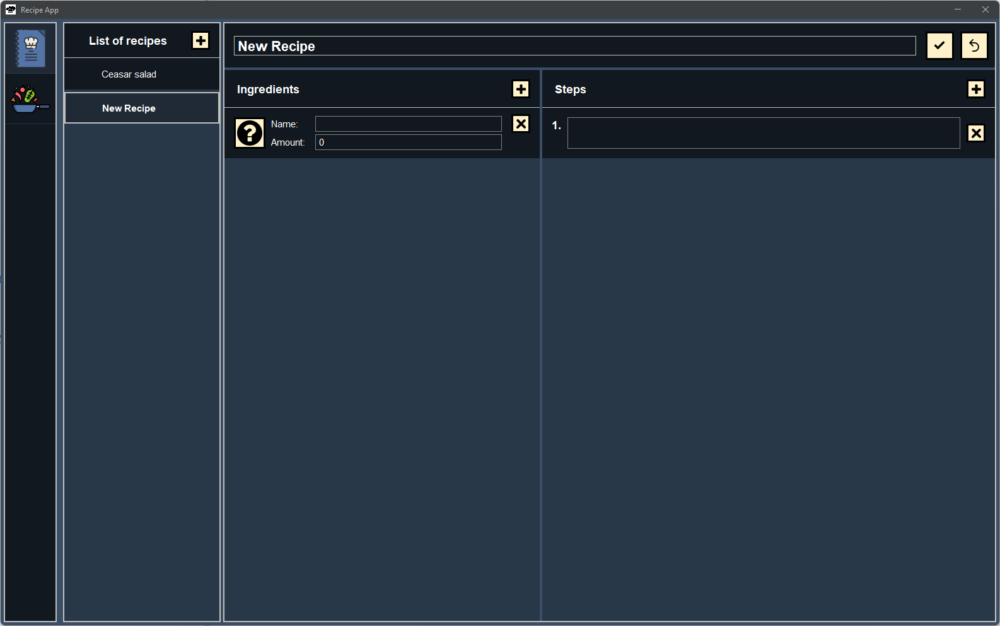
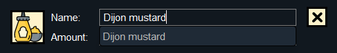
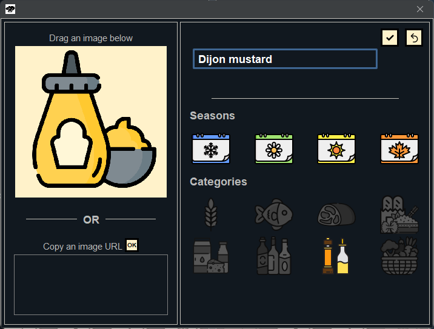

# RecipeApp

Welcome on the RecipeApp readme! This application helps you manage your ingredients and recipes.

## Table of content
* [General presentation](#general-presentation)
    - [Recipe tab](#the-recipe-tab)
    - [Ingredients tab](#the-ingredients-tab)
* [Roadmap](#roadmap)
    - [Features](#features)
    - [Technical](#technical)
## General presentation
The application is formed of two tabs accessible by clicking the buttons in the navigation bar on the right of the application:
### The Recipe tab
In the recipe tab, you can create recipes and save them.
To create a recipe, you need to add one to the recipe list on the right of the screen. By doing so, you will see a new recipe template.

In this template, you will be able to add ingredients and steps to the recipe.
For the ingredients, you can either add ones that you created in the ingredients tab like in the image below or add them to the recipe only without creating them in the ingredients tab (in this case they won't have an image).

Then, once you are done with writing your recipe, you can save it by clicking the :ballot_box_with_check: button on the top right of the screen.

### The ingredients tab

In the ingredient tab, you can create ingredient cards for all your ingredients and add an image, a name and characteristics (the season in which it grows/food category) to each of them.

To create an ingredient, click on the :heavy_plus_sign: button on the top right of the screen. 
A pop-up in which you can personalise the ingredient's card will appear.

There are two ways to add an image to an ingredient. You can either drop it on the :heavy_plus_sign: image, or copy a link in the box bellow it. To display the image of the link you just pasted, click on the OK button right above the link.
After having added the ingredient's image you can resize and move it.

To save, you can click the :ballot_box_with_check: button. Once your ingredient is ready, you can add it in all your recipes.

## Roadmap
### Features

- Option to create ingredient from the recipe tab.
- Option to create categories of ingredients of steps (for example: "1. ingredients for the dressing 2. ingredients for the salad).
- Option to sort your ingredients by their category (seasons and food category) as well as by diet (vegan, vegetarian, etc.)
- Option to sort your recipes alphabetically, by diet etc.
- Adding a community tab where you can share your recipes with other users.
- Adding a way to send recipes to another user.
- Adding a "shopping list" tab where you can add your ingredients and their amount needed for a recipe.

### Technical
- Create a spring boot server to manage recipes, ingredients and later users.
- Handle translation.
- Android app.
- Browser app.
 